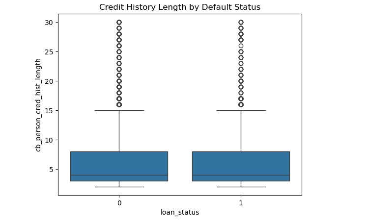
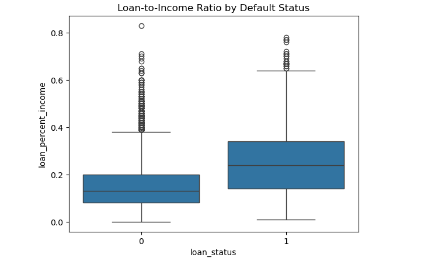
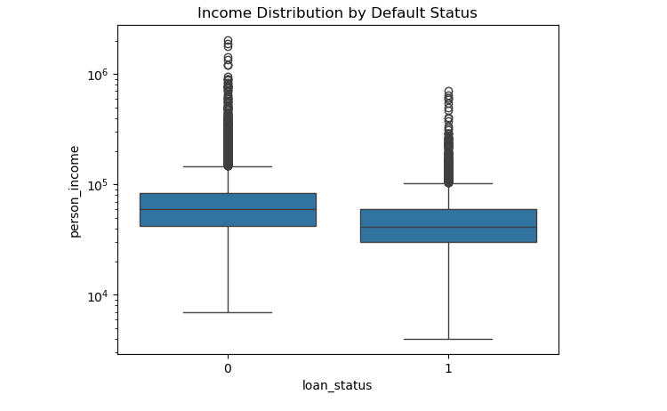

# Credit Risk Profiling & Default Drivers Analysis
## Project Overview

This project analyzes a consumer credit dataset to identify factors associated with loan default risk. The objective is to explore borrower characteristics, loan attributes, and affordability indicators in order to support more informed credit risk assessment and lending decisions.

### Dataset
The dataset contains over 32,000 loan records with information on borrower demographics, income, employment history, loan characteristics, and default outcomes.
### Key fields include:

Loan status (default / non-default)

Loan grade

Loan-to-income ratio

Borrower income

Credit history length

Historical default flag

Data Quality & Preparation

### Several data quality issues were identified and addressed prior to analysis:

Removed records with implausible borrower ages

Capped unrealistic employment length values

Handled missing employment length and interest rate values using median imputation

Standardized data types for numerical and categorical variables

All data cleaning decisions were made conservatively and documented to avoid distorting the underlying risk distribution.

### Key Analytical Questions

What is the overall default rate in the loan portfolio?

How does default risk vary across loan grades?

Is a higher loan-to-income ratio associated with increased default risk?

Does historical default behavior predict current default outcomes?

### Key Findings

The overall default rate in the dataset is approximately 22%, indicating a moderate level of credit risk.

Default rates increase consistently across lower loan grades, suggesting effective risk segmentation within the grading system.

Borrowers with higher loan-to-income ratios tend to default more frequently, highlighting affordability stress as a key risk indicator.

Applicants with a history of default are significantly more likely to default again, reinforcing the importance of historical behavior in credit assessment.

### Dashboard
### Credit History Length by Default Status

### Loan-to-Income Ratio by Default Status

### Income Distribution by Default Status

### Limitations

The dataset does not include macroeconomic variables such as interest rate cycles or unemployment trends.

Income values are self-reported and may contain reporting bias.

The analysis identifies associations rather than causal relationships.

### Business Implications

Loan grading appears to be an effective tool for differentiating borrower risk.

Borrowers with high loan-to-income ratios may require additional review or risk mitigation strategies.

Historical default indicators remain a strong predictor and should continue to inform credit decisioning processes.

### Tools Used

Python

pandas

numpy

matplotlib

seaborn

Jupyter Notebook
